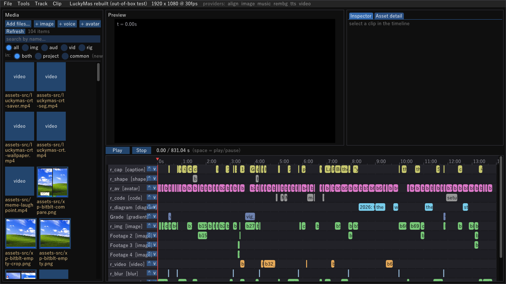
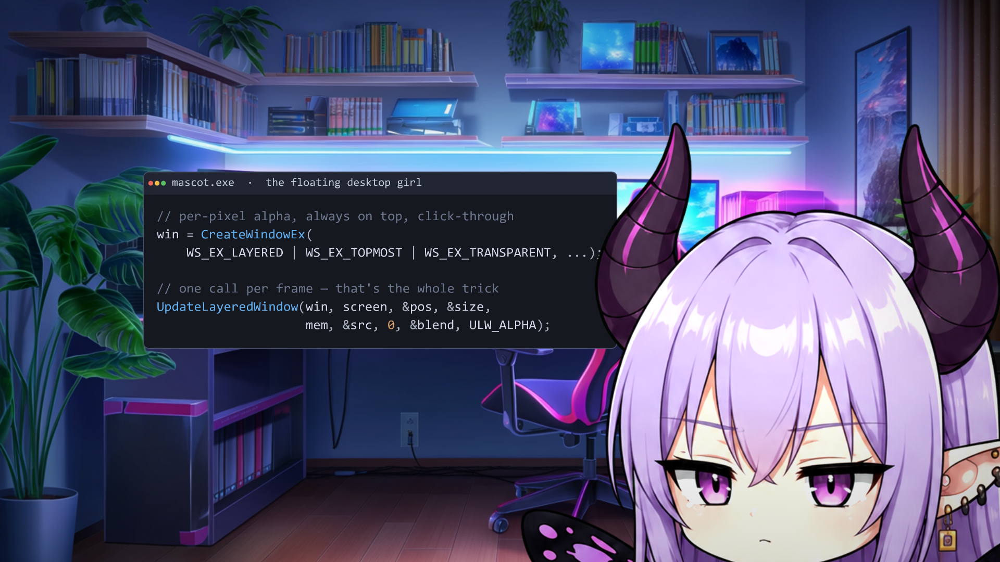
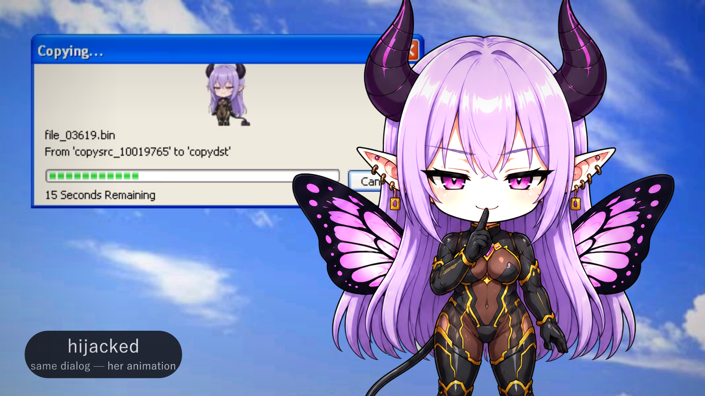
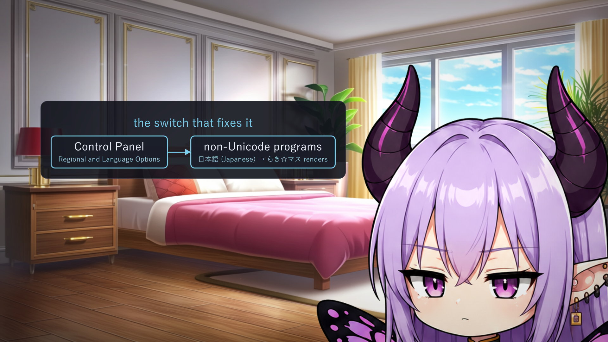

# slopstudio

A high-performance, local-first **AI video-generation NLE** — a timeline editor where
**each row is one generation pipeline** (TTS narration, an animated anime host, reaction
images, code cards, diagrams, music, effects), composed in a GPU render graph with a
latency-obsessed live preview and a deterministic record/export.



## Why this exists

slopstudio is the **ad-hoc video pipeline behind [Gemma-san Explains](https://youtube.com/@GemmaExplains)**
([@GemmaExplains](https://youtube.com/@GemmaExplains)) — a channel of technical deep-dives
narrated by a chuuni succubus-cosplaying cosmic architect named Gemma-san. Every video on
that channel is authored, generated, and rendered with this tool. It is built for *one*
format done well, not as a general-purpose editor.

It is **open-sourced (MIT) for anyone who finds it useful** — whether that's for making your
own narrated explainers, as a reference for a latency-obsessed compositing NLE, or as an
example of a pipeline a frontier LLM can drive end-to-end. There is no product, no account,
no cloud: it runs on your own hardware against your own models.

<table>
<tr>
<td></td>
<td></td>
</tr>
<tr>
<td></td>
<td>

**Every frame above is composited by the editor** from a single project file: a host sprite
with viseme lip-sync, syntax-highlighted code that types itself in, labelled diagrams,
sourced B-roll, and captions — each on its own timeline row, each a cached generation or a
pure-GPU native clip.

</td>
</tr>
</table>

## Why it's fast

Two layers, deliberately separated:

- **Compositing layer (instant).** Timing, transforms, effects, transitions, and layout are
  pure GPU compositing over a pull-based render graph with a param-hashed GPU texture cache.
  Changing one of these and seeing the result is sub-frame — that is the whole point.
- **Generation layer (async, cached).** AI generation (image/video/voice/music) is slow, so
  it never sits in the interactive loop. Generations run as background jobs producing
  content-addressed cached assets; editing a generation parameter re-queues a job while the
  preview keeps showing the last result plus a "regenerating" badge.

## Shape

```
  ┌──────────────────────────────┐         ┌──────────────────────────────────┐
  │  editor  (Windows-native)     │  HTTP/  │  providers  (the GPU host)        │
  │  C++ · Dear ImGui · D3D11     │   WS    │  Python services, one per model   │
  │                               │ ──────► │                                   │
  │  timeline of pipeline rows    │         │  tts   image  video  music  align │
  │  pull-based render graph      │ ◄────── │  (Qwen3-TTS, ComfyUI/Illustrious, │
  │  live preview + record/export │ assets  │   Wan2.2, ACE-Step+Jamendo, …)    │
  │  HTTP control API (LLM-drive) │         │                                   │
  └──────────────────────────────┘         └──────────────────────────────────┘
       runs on the workstation                  defaults to `lame` (config-driven)
```

The editor is a Windows PE cross-compiled from the Nix flake (mingw-w64 + the Dear ImGui
DX11 backend) and runs natively on Windows via WSLInterop — no WSLg performance tax.
Providers are out-of-process so a crashing model can never take down the editor, and their
endpoints live in `config.toml` so the whole thing is **redeployable on different hardware**
by editing one file.

## Build & run

Everything is provided by the flake; prefix host commands with `nix develop --command`.

```sh
nix develop                          # dev shell (python providers + mingw editor toolchain)
cp config.example.toml config.toml   # then edit endpoints/keys (config.toml is gitignored)

nix develop --command make -C editor            # build the editor → build/slopstudio.exe
nix develop --command python -m providers.tts   # run a provider locally (or deploy to a GPU host)

./build/slopstudio.exe examples/fufu-lab.slop.json    # open a project (Windows / WSLInterop)
```

**First run — stock assets.** The editor ships *no* art: the stock host rig (Gemma-san's
sprite sheet) and the shared backgrounds are a separate `stock-assets.zip` release asset,
fetched and unpacked into `presets/` on first launch. A fresh checkout plus that download is
everything the bundled example projects need to render. Full video projects live in their
own repo as portable project dirs (`<name>.slop.json` + `assets/`) and are opened the same
way — asset uris resolve relative to the project file.

**Prebuilt editor.** Nightly cross-compiled `slopstudio.exe` binaries are published to the
rolling [`nightly`](../../releases/tag/nightly) pre-release.

## Render a video

```sh
# 1080p60, space-efficient x264 sized to ~300 MB (YouTube re-encodes anyway):
nix develop --command bash tools/export.sh path/to/project.slop.json \
    --scale 1080 --fps 60 --target-mb 300 --out exports/project.mp4
```

Or use **File ▸ Render video…** in the editor. The render is deterministic: the editor
streams the full-res composite to ffmpeg, which encodes the video and muxes the audio
assembled from the project's export plan (clip offsets, gains, sourced-music credits).

## Author a video as an LLM

The project file (`*.slop.json`) is the human- *and* machine-editable source of truth. An
agent composes a cut with `tools/slop.py` (a beats → skeleton → lint → render workflow) and
generates voice/visemes headlessly — see [`docs/LLM_WORKFLOW.md`](docs/LLM_WORKFLOW.md) and
[`docs/PROJECT_FORMAT.md`](docs/PROJECT_FORMAT.md).

## Models (all commercial-safe — this is MIT + monetized output)

| Role | Model | License |
|---|---|---|
| TTS / voice design | Qwen3-TTS 1.7B VoiceDesign | Apache-2.0 |
| Anime image gen | Illustrious-XL 2.0 (+ character LoRA) | CreativeML Open RAIL-M |
| Image/video backend | ComfyUI | GPL-3.0 (separate process) |
| Image→video motion | Wan 2.2 (procedural 2.5D default) | Apache-2.0 |
| Music gen / sourcing | ACE-Step 1.5 / Jamendo (CC-BY) | MIT / per-track |
| Avatar | pngtuber state machine (Inochi2D optional) | — / BSD-2 |
| Word timing / visemes | WhisperX / Rhubarb Lip Sync | BSD / MIT |

See [`docs/RESEARCH.md`](docs/RESEARCH.md) for the full mid-2026 survey, the runner-ups, and
the licensing rationale.

## Documentation

| | |
|---|---|
| [`docs/ARCHITECTURE.md`](docs/ARCHITECTURE.md) | how it all fits together |
| [`docs/LLM_WORKFLOW.md`](docs/LLM_WORKFLOW.md) | compose a video as an agent |
| [`docs/PROJECT_FORMAT.md`](docs/PROJECT_FORMAT.md) | the `*.slop.json` schema |
| [`docs/PROVIDER_PROTOCOL.md`](docs/PROVIDER_PROTOCOL.md) | how the editor talks to models |
| [`docs/RESEARCH.md`](docs/RESEARCH.md) | model survey + licensing rationale |

## License

MIT — see [LICENSE](LICENSE). Generated content is yours; sourced music/art carry their own
licenses, which slopstudio tracks and turns into automatic on-screen credits.
